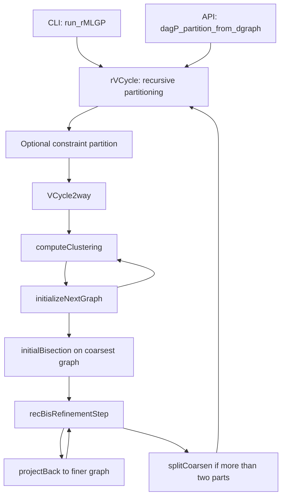

# Architecture and data model

Scope: commit `333c3f2822cd300983c9ad71ed6c8961e4d11f1d`.
See the [guide index](README.md) and [algorithm explanation](algorithms.md).

## Source map

| File or module | Responsibility and useful entry points |
| --- | --- |
| [rMLGP.c](../src/recBisection/rMLGP.c) | CLI argument handling, graph loading, repeated runs, reports, partition files; `main`, `run_rMLGP` |
| [dagP.h](../src/recBisection/dagP.h), [dagP.c](../src/recBisection/dagP.c) | Public C API, also callable from C++; `dagP_partition_from_dgraph` retains the lowest-cut run |
| [rvcycle.c](../src/recBisection/rvcycle.c) | Recursive split into the requested number of parts; `rVCycle`, `splitCoarsen` |
| [vcycle2way.c](../src/recBisection/vcycle2way.c) | Multilevel bisection; `VCycle2way`, `initializeNextGraph`, `projectBack` |
| [clustering.c](../src/common/clustering.c) | Select admissible vertex contractions; `computeClustering` |
| [initialBisection.c](../src/recBisection/initialBisection.c) | Dispatch initial heuristics, try both graph directions, retain the best trial |
| [dgraphBisection.c](../src/recBisection/dgraphBisection.c) | Greedy graph growth and repair of undirected cuts |
| [refinementBis.c](../src/recBisection/refinementBis.c) | Balance repair, FM vertex moves, KL swaps; `recBisRefinementStep` |
| [undirPartitioning.c](../src/common/undirPartitioning.c) | METIS/Scotch adapters, undirected starting heuristics, `conpar` constraint partitioning |
| [dgraph.h](../src/common/dgraph.h), [dgraph.c](../src/common/dgraph.c) | Graph storage, weights, cut evaluation, quotient-cycle checks, levels, graph transformations |
| [dgraphReader.c](../src/common/dgraphReader.c), [dgraphDotReader.cpp](../src/common/dgraphDotReader.cpp) | Readers, binary cache, DOT and partition writers |
| [dgraphTraversal.c](../src/common/dgraphTraversal.c) | DFS/BFS and randomized orders; topological orders of vertices and parts |
| [option.c](../src/common/option.c), [option.h](../src/common/option.h) | Defaults, CLI parsing, option copying, symbolic algorithm IDs |
| [utils.c](../src/common/utils.c) | Heaps, randomization, timing, allocation and fatal-error helpers |
| [info.c](../src/common/info.c), [debug.c](../src/common/debug.c) | Run statistics, per-level timing, diagnostic graph output |
| [ginfo.c](../src/common/ginfo.c) | Separate executable reporting graph statistics |
| [useapi.cpp](../src/useapi.cpp) | Library integration example; not a default SCons target |

## Execution path



There are two distinct hierarchies. A **coarsening hierarchy** is a linked chain
of successively smaller representations of one bisection problem. A **recursive
bisection hierarchy** is a binary tree of induced subgraphs that produces the
final part count. A new multilevel bisection can occur at every internal tree node.

The CLI and API have separate outer run loops; the CLI does not call the public
partition function. Both load/refresh graph metadata, fill unspecified bounds,
seed the random generator, and invoke `rVCycle`. The CLI prints every run. The
API copies the best run into the caller's assignment array.

## Graph representation

`dgraph` stores each directed edge twice, in incoming and outgoing adjacency
arrays. This makes predecessor and successor scans cheap, which is essential
for preserving acyclicity during moves.

| Field or type | Meaning |
| --- | --- |
| `idxType` | `int`, used for vertex IDs, adjacency positions, counts, assignments |
| `vwType` | `int`, vertex weight |
| `ecType` | `long long`, edge cost and cut value |
| `nVrtx`, `nEdge` | Number of vertices and directed edges |
| `inStart[v]`, `inEnd[v]` | Inclusive range of incoming adjacency positions for vertex `v` |
| `in[e]`, `ecIn[e]` | Predecessor ID and edge cost at incoming position `e` |
| `outStart[v]`, `outEnd[v]` | Inclusive range of outgoing positions |
| `out[e]`, `ecOut[e]` | Successor ID and edge cost at outgoing position `e` |
| `vw[v]` | Weight of vertex `v` |
| `sources`, `targets` | Lists of zero-indegree and zero-outdegree vertices, with counts |
| `totvw`, `totec` | Aggregate vertex/edge weights, stored as `double` |
| `maxVW`, `maxEC`, degree maxima | Cached metadata used by heuristics and reports |
| `hollow` | Marker for a vertex originating in another part; not the partition assignment |
| `frmt` | Weight flags: `0` unweighted, `1` vertex weights, `2` edge costs, `3` both |

Vertex IDs are **1-based**, adjacency positions are **0-based**, and part labels
are **0-based**. Allocate `parts` with at least `nVrtx + 1` elements; ignore slot
zero. An empty adjacency range has `end < start`. Do not mistake `inEnd` for an
exclusive CSR offset.

For `1 -> 2 -> 3`, the incoming representation is:

```text
vertex v:       1  2  3
inStart[v]:     0  0  1
inEnd[v]:      -1  0  1
in[]:          [1, 2]
```

`fillOutFromIn` builds the outgoing representation from incoming data.
`set_dgraph_info` refreshes weight summaries; degree statistics are also computed
by the public read/partition wrappers. Graph-construction code must supply
consistent adjacency, weights, and source/target lists before partitioning.

## Hierarchy structures and ownership

`coarsen` (in [vcycle2way.h](../src/recBisection/vcycle2way.h)) holds a graph,
its partition, constraint flags, and links to adjacent coarsening levels.
`leader[v]` names a cluster representative; `new_index[v]` maps a fine vertex
to its compact coarse vertex ID. Representatives must be their own leaders.

`rcoarsen` (in [rvcycle.h](../src/recBisection/rvcycle.h)) adds recursive child
links and index translations. `next_index` maps parent vertices into their
child graph; `previous_index` maps child vertices back to the parent. After
assignments are combined, child objects are freed; the returned object should
not be treated as a persistent navigable recursion tree.

The caller owns the original `dgraph`, the `MLGP_option` container, and the
result array. The partitioner creates coarse and recursive subgraphs.
`freeCoarsen` frees its graph and its storage, whereas `freeCoarsenHeader` keeps
the original graph alive. The corresponding recursive helpers follow the same
distinction. Public `dagP_free_graph` and `dagP_free_option` free internal arrays,
not a caller's stack/heap container; the caller separately frees `parts`.

`MLGP_info` records one multilevel bisection, with per-level arrays;
`rMLGP_info` adds recursive child statistics. These are reporting structures,
not the returned partition. Some legacy statistics are imperfect; see
[usage limitations](usage.md#implementation-limits).
