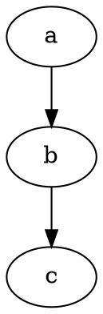

# Building, inputs, and library use

Scope: commit `333c3f2822cd300983c9ad71ed6c8961e4d11f1d`.
See the [guide index](README.md), [architecture](architecture.md), and
[algorithms](algorithms.md).

## Build the committed version

The build requires SCons and C/C++ compilers; C++11 is enabled for the DOT
reader. The template selects GCC/G++ and G++ for linking. Linux builds use
static linking, so the required static runtime libraries must be available.

In a clean checkout:

```sh
cp config.py.template config.py
scons all
```

The default `scons` targets are `exe/rMLGP` and `exe/ginfo`, which depend on
`lib/libdagp.a`. Aliases include `dagplib`, `rMLGP`, `ginfo`, `tools`, and `all`.
`src/useapi.cpp` must be compiled separately. No scheduler executable is built
by this revision's SConstruct, even though the older README mentions one.

Set `debug = 1` in `config.py` for compiler debug symbols. `metis = 1` and/or
`scotch = 1` enable the external partitioning adapters; supply their include
directories, library names, and search paths through `extincludes`, `extlibs`,
and `extlibpath`. These features are disabled in the template. The default
undirected algorithm selector is METIS; choose `--undir_alg 1` for Scotch when
using a Scotch-only build.

To keep local edits and existing build products out of an experiment, export
the commit first and build inside that directory:

```sh
snapshot_dir=$(mktemp -d /tmp/dagp-baseline-XXXXXX)
git archive 333c3f2822cd300983c9ad71ed6c8961e4d11f1d | tar -x -C "$snapshot_dir"
cd "$snapshot_dir"
cp config.py.template config.py
scons all
```

## CLI

```sh
./exe/rMLGP data/2mm_10_20_30_40.dot 4 --print 1 --ratio 1.1
./exe/ginfo data/2mm_10_20_30_40.dot
```

The positional arguments are input filename and requested number of parts.
For repeatable validation, specify a seed and disable the binary cache:

```sh
./exe/rMLGP data/2mm_10_20_30_40.dot 4 --print 1 --ratio 1.1 --seed 1 --debug 1 --use_binary_input 0 --write_parts 1
```

`--debug 1` checks final partition acyclicity in the CLI. Higher debug levels
add more checks and diagnostic output; some checks are also compile-time gated
by `_dGP_DEBUG`. `--print` controls reports, not validation. Seed zero means
time-based initialization; a nonzero seed starts a reproducible random sequence
within a compatible build/environment. Repeated runs advance that sequence.

`--write_parts 1` writes these files beside the input:

```text
<input>.partsfile.part_<k>.seed_<seed>.txt
<input>.partitioned.part_<k>.seed_<seed>.dot
```

The text file has one part label per line: line one is internal vertex 1.
The DOT file colors the assignment. Filenames omit the run index, so multiple
runs overwrite them and leave the last run, not necessarily the best one.
The API differs: it returns the best cut and corresponding assignment.

The reported balance is `maximum_part_weight / (total_vertex_weight / k)`.
The cut counts weighted crossing edges. Neither quantity is a task schedule
or measured execution time.

## Main options and available algorithms

Defaults below come from `initMLGPoptions`; CLI parsing can override them.

| Option | Default | Meaning |
| --- | --- | --- |
| `--ratio` | 1.03 | Target imbalance multiplier for unspecified upper bounds |
| `--part_lb`, `--part_ub` | -1 | Unspecified bounds; CLI copies the given value to all parts |
| `--seed`, `--runs` | 0, 1 | Random seed and number of complete partition runs |
| `--co_stop_size` | `50*k` | Coarsest target vertex count |
| `--co_stop_level`, `--co_stop_ratio` | 20, 0.9 | Maximum coarsening levels and minimum useful shrinkage test |
| `--co_match` | 3 | Hybrid acyclic aggregation |
| `--co_dir` | 2 | Consider incoming and outgoing candidates |
| `--co_match_level` | 2 | Alternate top/bottom levels |
| `--co_norder`, `--co_eorder` | 2, 2 | Randomized BFS topological order; edge/neighbor-weight score |
| `--co_match_isolatedmatch` | 1 | Enable isolated-vertex grouping |
| `--conpar`, `--conpar_fix` | 1, 1 | Constraint partitioning and its acyclicity repair |
| `--anchored` | 0 | Optional synthetic source/target graph |
| `--inipart`, `--inipart_nrun` | 13, 5 | Initializer and trial count; initializer 13 uses one trial |
| `--refinement`, `--ref_step` | 1, 10 | FM refinement and maximum ordinary passes per level |
| `--use_binary_input` | 1 | Prefer/create binary cache |
| `--write_parts`, `--print`, `--debug` | 0, 0, 0 | Assignment output, reporting, runtime checks |

When neither external library is compiled in, `processMLGPargs` unconditionally
sets `conpar = 0` and `inipart = IP_GGG_TWO` (11), including when the CLI user
specified a different initializer. The public API initializer does **not** run
this fallback. Set those two fields explicitly for a library-free API call.

The actual initial-bisection dispatcher supports:

| ID | Symbol | Behavior |
| --- | --- | --- |
| 0 | `IP_ALL` | Alternate between `IP_UNDIR` and `IP_GGG_TWO` across trials; not every declared method |
| 4 | `IP_GGG` | Greedy topological growth by cut gain |
| 6 | `IP_UNDIR` | External undirected cut followed by repair |
| 10 | `IP_RECBISS` | Nested recursive partition call using `IP_ALL` |
| 11 | `IP_GGG_TWO` | Two-phase greedy growth |
| 12 | `IP_GGG_IN` | Greedy growth using incoming costs |
| 13 | `IP_CONPAR` | Initialize from propagated constraint flags |
| 14 | `IP_UNDIRRAND` | Random undirected bisection followed by repair |
| 15 | `IP_UNDIRGGG` | Undirected greedy bisection followed by repair |

Initializer IDs 1, 2, 3, 5, 7, 8, and 9 have header names but no case in
`initialBisection`. The refinement dispatcher supports 0 (none), 1 (FM),
2 (FM from the more loaded part), 3 (KL swaps), and 4 (FM then KL).
The declared k-way refinement IDs 5–8 are not implemented by that dispatcher.
Likewise, `--obj` does not switch the implemented partitioning path away from
edge cut. Consult dispatchers as well as header comments when extending code.

## Input formats and side effects

`readDGraph` dispatches by filename substring: `.bin`, `.dot`, `.mtx`, `.fab`,
and otherwise the native DG reader. It is not a strict final-extension parser.

**DOT.** The C++ reader is a restricted, line-oriented parser, not a full
Graphviz parser. Use a graph-opening line, explicit vertex declarations, one
vertex or edge per line, and a separate closing brace. All edge endpoints must
have vertex declarations; it collects vertices on its first pass and edges on
its second. Simple integer `weight`/`Weight` attributes default to one:



Internal IDs follow vertex declaration order. Reading DOT writes
`<input>.nodemappings`, mapping names to 1-based internal IDs. The mapping file
is emitted in name-map order, so use its numeric column rather than line order.
Undirected `--` edges are rejected. Comment detection skips entire lines
containing comment markers; avoid inline comments, elaborate attributes, and
general DOT syntax that the tokenizer does not support.

**DG / DGRAPH.** The native reader consumes whitespace-separated values in
this order: vertex count, edge count, `n+1` incoming start offsets, then `m`
predecessor IDs. Offsets start at zero and the last offset equals `m`; vertex
IDs start at one. Vertex and edge weights are set to one. For `1 -> 2 -> 3`:

```text
3 2
0 0 1 2
1 2
```

**Matrix Market.** The reader requires a square matrix, reads its sparsity
pattern, and gives vertices/edges unit weights. `loadFromCSC` counts entries
strictly above and below the diagonal, keeps the more populated triangle
(upper on ties), and discards the other triangle and diagonal. A retained
entry `(row, column)` becomes `row -> column`. This creates a DAG but does not
preserve an arbitrary matrix's complete directed graph or numeric values.

**FAB.** A specialized `readDGraphFab` branch also exists. Treat its parser
as the format contract; no committed sample fixture is provided for it.

**Binary cache.** With caching enabled, `<input>.bin` takes precedence over
the text input and is written after a successful text read if absent. Source
timestamps are not compared. Remove a stale cache or pass
`--use_binary_input 0` when checking text edits. A direct `.bin` filename is
always read as binary. `ginfo` always enables cache preference. The binary
format serializes native C fields/arrays without a versioned portable schema;
it should be treated as a local cache. Several readers reject empty edge sets.

## C/C++ API

Include [dagP.h](../src/recBisection/dagP.h). Its declarations use `extern "C"`
under C++. The interface exposes seven functions:

| Function | Contract |
| --- | --- |
| `dagP_init_parameters(opt, k)` | Initialize defaults and allocate bound arrays |
| `dagP_init_filename(opt, name)` | Set filename and derived `<name>_dagP.out` option string; does not itself write a result |
| `dagP_opt_reallocUBLB(opt, k)` | Change part count, reallocate/reset bounds to -1; does not recompute all other defaults |
| `dagP_read_graph(name, G, opt)` | Load graph and refresh metadata |
| `dagP_partition_from_dgraph(G, opt, parts)` | Run `opt.runs` partitions, fill `parts[1..n]` with the lowest-cut assignment, return its `ecType` cut |
| `dagP_free_graph(G)` | Release graph arrays |
| `dagP_free_option(opt)` | Release option bound arrays |

Minimal C++ example for a build without METIS/Scotch, saved as `example.cpp`:

```cpp
#include <cstdio>
#include <vector>
#include "dagP.h"

int main(int argc, char **argv) {
    if (argc != 2) return 1;
    MLGP_option opt = {};
    dgraph graph = {};
    dagP_init_parameters(&opt, 4);
    dagP_init_filename(&opt, argv[1]);
    opt.conpar = 0;
    opt.inipart = IP_GGG_TWO;
    opt.seed = 1;
    opt.ratio = 1.1;
    opt.use_binary_input = 0;
    dagP_read_graph(argv[1], &graph, &opt);
    std::vector<idxType> parts(graph.nVrtx + 1);
    ecType cut = dagP_partition_from_dgraph(&graph, &opt, parts.data());
    std::printf("edge cut: %lld\n", static_cast<long long>(cut));
    for (idxType v = 1; v <= graph.nVrtx; ++v)
        std::printf("%d %d\n", v, parts[v]);
    dagP_free_graph(&graph);
    dagP_free_option(&opt);
    return 0;
}
```

```sh
g++ -std=c++11 -Wall -Isrc/common -Isrc/recBisection example.cpp lib/libdagp.a -lm -o example
./example data/2mm_10_20_30_40.dot
```

For a library built with METIS/Scotch, also link those libraries and their
dependencies. The existing `src/useapi.cpp` demonstrates changing the requested
part count, but does not apply the library-free fallback above.

Use positive part/trial counts and valid DAG input. Despite the `const`
option pointer, partitioning fills negative entries in the arrays referenced
by `opt.lb` and `opt.ub`. Reset these bounds before reusing options for a
different graph when you want automatically recomputed bounds. Several failure
paths call `u_errexit` and terminate the process; integer return types do not
mean errors are always recoverable. Graph reversal and global random state
also mean the interface should not be assumed reentrant on shared inputs.

## Implementation limits

These observations concern this committed baseline; they are not a review of
working-tree changes.

- Balance tests include maximum-vertex slack; strict balance and nonempty
  part requirements should be checked on the returned assignment.
- API run selection compares cuts and does not separately reject an infeasible
  result or unconditionally validate quotient acyclicity.
- Nonuniform bounds are not correctly sliced for the second recursive child;
  see [recursive bounds](algorithms.md#recursive-bisection-rvcycle).
- Some CLI cut reports cast `ecType` to `int`, which can truncate large cuts.
  The API return type retains the wider value.
- The CLI's reported “Standard Deviation” is not a statistical standard
  deviation: its loop overwrites an absolute difference and divides the final
  difference by run count. It also reads an uninitialized `nbcomm` array in
  unused communication-summary calculations. Use raw run results for analysis.
- `ginfo`'s critical-path scan excludes the last vertex ID. Treat that reported
  value as diagnostic rather than a general exact longest-path result.
- The binary writer writes `n+1` source/target entries while the reader reads
  `n`; this can misalign cached target metadata. Text-input validation avoids
  relying on that cache representation.
- Some temporary allocations are not freed in the baseline. Ownership notes
  explain intended usage, not a guarantee of leak-free repeated operation.

## Verification of this documentation

On 2026-09-07, the baseline was exported into a temporary directory and built
with the unmodified `config.py.template` (GCC/G++, no METIS/Scotch).
`scons all` completed with existing compiler warnings. Both smoke commands
above completed. The fixed-seed command also completed with debug checks.
The API example above was compiled and executed against that same library.

For the fixed-seed CLI run, the sample contained 36,500 vertices and 62,200
edges; edge cut was 5,160 and reported balance was 1.061699. The emitted
assignments were independently checked against the text DOT and node mapping
for part labels, weighted cut, balance, and forward-only quotient edges.
These values describe this local build, not universal expected outputs across
random seeds or external-library configurations.

The committed SConstruct has no `test` target and the committed tree has no
`tests/` directory, despite the testing guidance in AGENTS.md. Untracked tests
were excluded from baseline verification. No source or build-file changes
were made for this documentation.
